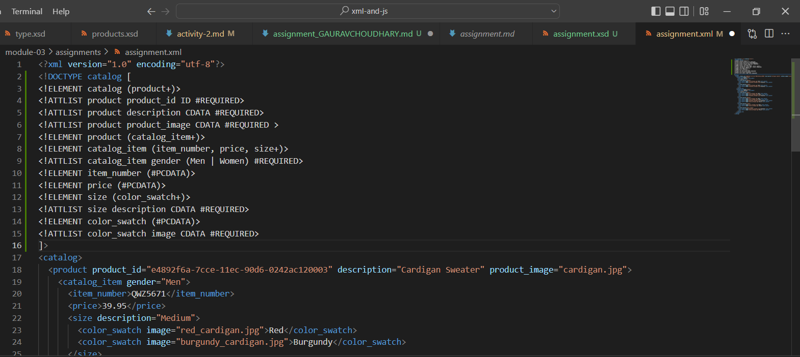
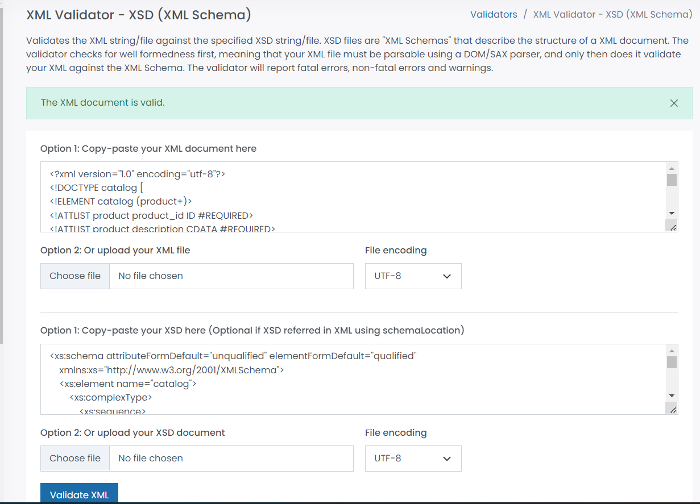

# Assignment

1. Open `module-3/assignments/assignment.xml` in your editor
Ans. 

2. Create DTD for this file and validate it using any of the tools we used
Ans. 
<!ELEMENT catalog (product+)>
<!ATTLIST product product_id ID #REQUIRED>
<!ATTLIST product description CDATA #REQUIRED>
<!ATTLIST product product_image CDATA #REQUIRED >
<!ELEMENT product (catalog_item+)>
<!ELEMENT catalog_item (item_number, price, size+)>
<!ATTLIST catalog_item gender (Men | Women) #REQUIRED>
<!ELEMENT item_number (#PCDATA)>
<!ELEMENT price (#PCDATA)>
<!ELEMENT size (color_swatch+)>
<!ATTLIST size description CDATA #REQUIRED>
<!ELEMENT color_swatch (#PCDATA)>
<!ATTLIST color_swatch image CDATA #REQUIRED>
]>

3. Create XSD for this file and validate it using any of the tools we used
Ans. 
<xs:schema attributeFormDefault="unqualified" elementFormDefault="qualified"
xmlns:xs="http://www.w3.org/2001/XMLSchema">
<xs:element name="catalog">
    <xs:complexType>
        <xs:sequence>
            <xs:element name="product">
                <xs:complexType>
                    <xs:sequence>
                            <xs:element name="catalog_item" maxOccurs="unbounded" minOccurs="0">
                                <xs:complexType>
                                    <xs:sequence>
                                        <xs:element type="xs:string" name="item_number"/>
                                        <xs:element type="xs:float" name="price"/>
                                        <xs:element name="size" maxOccurs="unbounded" minOccurs="0">
                                            <xs:complexType>
                                                <xs:sequence>
                                                    <xs:element name="color_swatch" maxOccurs="unbounded" minOccurs="0">
                                                        <xs:complexType>
                                                            <xs:simpleContent>
                                                                <xs:extension base="xs:string">
                                                                    <xs:attribute type="xs:string" name="image" use="optional"/>
                                                                </xs:extension>
                                                            </xs:simpleContent>
                                                        </xs:complexType>
                                                    </xs:element>
                                                </xs:sequence>
                                                <xs:attribute type="xs:string" name="description" use="optional"/>
                                            </xs:complexType>
                                        </xs:element>
                                    </xs:sequence>
                                    <xs:attribute type="xs:string" name="gender" use="optional"/>
                                </xs:complexType>
                            </xs:element>
                        </xs:sequence>
                        <xs:attribute type="xs:string" name="product_id"/>
                        <xs:attribute type="xs:string" name="description"/>
                        <xs:attribute type="xs:string" name="product_image"/>
                    </xs:complexType>
                </xs:element>
            </xs:sequence>
        </xs:complexType>
    </xs:element>
</xs:schema>

4. Explain your thought process for these 2 declarations.
Ans.

#For DTD
While working with DTD I started with catalog then with has prodcut+. The + sign indicates that there are other elements inside that particular element. Now, the product has different attributes which are product description product_image, and product_id which are under CDATA which means that it is just a text and will not be parsed by the parser. Tags inside the text will not be expanded. After that we have catalog_item+ inside the product tag which has further attributes of Gender and is REQUIRED field. Furthermore, it has other tags which are item_number, price and size. And later everything else goes into succession just like the the above tags.

#For XSD
I followed the same strategy as DTD by going in chronological order. It has complex types which contains other elements. The simple content doesn't contain any other elements. It basically lets you define the structure and data  type of the XML document.

Create `module-3/assignments/assignment_YOURNAME.md` and add your theory answers. Add screenshots of each step to the file.